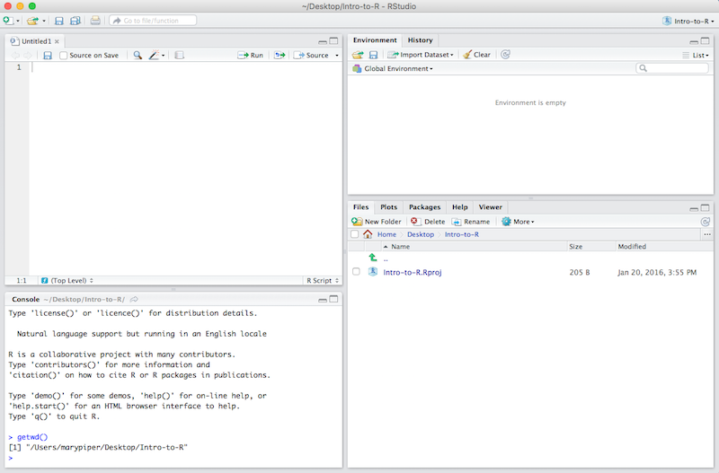
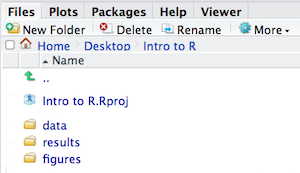
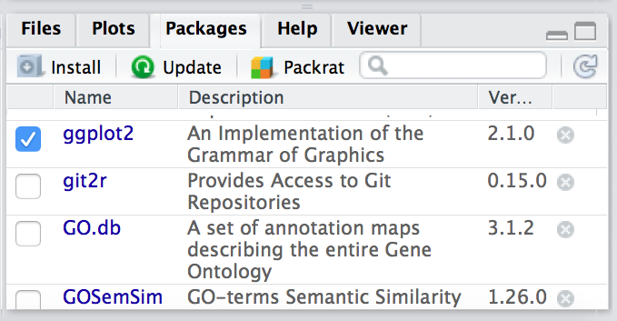

## RStudio Interface

**The RStudio interface has four main panels:**

1. **Console**: where you can type commands and see output. *The console is all you would see if you ran R in the command line without RStudio.*
2. **Script editor**: where you can type out commands and save to file. You can also submit the commands to run in the console.
3. **Environment/History**: environment shows all active objects and history keeps track of all commands run in console
4. **Files/Plots/Packages/Help**

## Creating a new project directory in RStudio 

1. Open RStudio
2. Go to the `File` menu and select `New Project`.
3. In the `New Project` window, choose `New Directory`. Then, choose `New Project`. Name your new directory `Intro-to-R` and then "Create the project as subdirectory of:" the Desktop (or location of your choice).
4. Click on `Create Project`.
5. After your project is completed, if the project does not automatically open in RStudio, then go to the `File` menu, select `Open Project`, and choose `Intro-to-R.Rproj`.
6. When RStudio opens, you will see three panels in the window.
7. Go to the `File` menu and select `New File`, and select `R Script`. The RStudio interface should now look like the screenshot below.


## Organizing your working directory & setting up

### Viewing your working directory

Before we organize our working directory, let's check to see where our current working directory is located by typing into the console:

```r
getwd()
```

Your working directory should be the `Intro-to-R` folder constructed when you created the project. The working directory is where RStudio will automatically look for any files you bring in and where it will automatically save any files you create, unless otherwise specified. 

You can visualize your working directory by selecting the `Files` tab from the **Files/Plots/Packages/Help** window. 




### Structuring your working directory
To organize your working directory for a particular analysis, you should separate the original data (raw data) from intermediate datasets. For instance, you may want to create a `data/` directory within your working directory that stores the raw data, and have a `results/` directory for intermediate datasets and a `figures/` directory for the plots you will generate.

Let's create these three directories within your working directory by clicking on `New Folder` within the `Files` tab. 


When finished, your working directory should look like:



## Packages and Libraries

**Packages** are collections of R functions, data, and compiled code in a well-defined format, created to add specific functionality. There are 10,000+ user contributed packages and growing.

There are a set of **standard (or base) packages** which are considered part of the R source code and automatically available as part of your R installation. Base packages contain the **basic functions** that allow R to work, and enable standard statistical and graphical functions on datasets. 

The directories in R where the packages are stored are called the **libraries**. The terms *package* and *library* are sometimes used synonomously. 

To check which libraries are installed: 

```r
library()
```

You can also check what packages are loaded in your R session by typing into the console:

```r
sessionInfo()
```

In this workshop we will mostly be using functions from the standard base packages. However, the more you work with R you will come to realize that there is a cornucopia of R packages that offer a wide variety of functionality. To use additional packages will require installation. Many packages can be installed from the [CRAN](http://cran.r-project.org/) or [Bioconductor](https://www.bioconductor.org/) repositories.

### Package installation from CRAN 

CRAN is a repository where the latest downloads of R (and legacy versions) are found in addition to source code for thousands of different user contributed R packages.


Packages for R can be installed from the [CRAN](http://cran.r-project.org/) package repository using the `install.packages` function. This function will download the source code from on the CRAN mirrors and install the package (and any dependencies) locally on your computer. 

An example is given below for the `ggplot2` package that will be required for some images we will create later on. Run this code to install `ggplot2`.


```r
install.packages('ggplot2')
```
### Package installation from Bioconductor
Alternatively, packages can also be installed from [Bioconductor](https://www.bioconductor.org/), another repository of packages which provides tools for the analysis and comprehension of high-throughput **genomic data**. These packages includes (but is not limited to) tools for performing statistical analysis, annotation packages, and accessing public datasets.


There are many packages that are available in CRAN and Bioconductor, but there are also packages that are specific to one repository. Generally, you can find out this information with a Google search or by trial and error. To install from Bioconductor, you will first need to install BiocManager. *This only needs to be done once ever for your R installation.* 

**If you were successful with the installation from CRAN, you do not need to run this**

```r
install.packages("BiocManager")
```

Then you can use the `install()` function to install a package by providing the name in quotations. Here we show that the same package `ggplot2` is available through Bioconductor:

```r
library(BiocManager)
install("DESeq2")
```

You will see the following at one point, go ahead and type 'a'

```r
Update all/some/none? [a/s/n]:
```

### Loading libraries
Once you have the package installed, you can load it into your R session for use. Any of the functions that are specific to that package will be available for you to use by simply calling the function as you would for any of the base functions. *Note that quotations are not required here.*


```r
library(DESeq2)
library(ggplot2)
```

You can also check what is loaded in your current environment by using `sessionInfo()` and you you should see your package listed as:

```r
other attached packages:
[1] ggplot2_2.0.0
```

In this case there are several other packages that were also loaded along with `ggplot2`.

### Finding functions specific to a package

If this is your first time using `ggplot2`, how do you know where to start and what functions are available to you? One way to do this, is by using the `Package` tab in RStudio. If you click on the tab, you will see listed all packages that you have installed. For those *libraries that you have loaded*, you will see a blue checkmark in the box next to it. Scroll down to `ggplot2` in your list:

  


If your library is successfully loaded you will see the box checked, as in the screenshot above. Now, if you click on `ggplot2` RStudio will open up the help pages and you can scroll through.

An alternative is to find the help manual online, which can be less technical and sometimes easier to follow. For example, [this website](https://ggplot2.tidyverse.org/reference/index.html) is much more comprehensive for ggplot2 and is the result of a Google search. Many of the Bioconductor packages also have very helpful vignettes that include comprehensive tutorials with mock data that you can work with.

If you can't find what you are looking for, you can use the [rdocumention.org](http://www.rdocumentation.org) website that search through the help files across all packages available.

### Cryptic error messages

It is very likely that someone else has encountered this same problem already! 

* Start by googling the error message.  However, this doesn't always work very well because often, package developers rely on the error catching provided by R. You end up with general error messages that might not be very helpful to diagnose a problem (e.g. "subscript out of bounds").

* Check stackoverflow. Search using the `[r]` tag. Most questions have already been answered, but the challenge is to use the right words in the search to find the answers: [http://stackoverflow.com/questions/tagged/r](http://stackoverflow.com/questions/tagged/r)

---

### More resources
* The [Posting Guide](http://www.r-project.org/posting-guide.html) for the R
  mailing lists.
* [How to ask for R help](http://blog.revolutionanalytics.com/2014/01/how-to-ask-for-r-help.html)
  useful guidelines
* The [Introduction to R](http://cran.r-project.org/doc/manuals/R-intro.pdf) can also be dense for people with little programming experience but it is a good place to understand the underpinnings of the R language.
* The [R FAQ](http://cran.r-project.org/doc/FAQ/R-FAQ.html) is dense and technical but it is full of useful information.
* [RStudio IDE cheatsheet](https://github.com/rstudio/cheatsheets/raw/master/rstudio-ide.pdf)

---

*This lesson has been developed by members of the teaching team at the [Harvard Chan Bioinformatics Core (HBC)](http://bioinformatics.sph.harvard.edu/). These are open access materials distributed under the terms of the [Creative Commons Attribution license](https://creativecommons.org/licenses/by/4.0/) (CC BY 4.0), which permits unrestricted use, distribution, and reproduction in any medium, provided the original author and source are credited.*

* *The materials used in this lesson is adapted from work that is Copyright © Data Carpentry (http://datacarpentry.org/). 
All Data Carpentry instructional material is made available under the [Creative Commons Attribution license](https://creativecommons.org/licenses/by/4.0/) (CC BY 4.0).*

