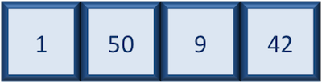
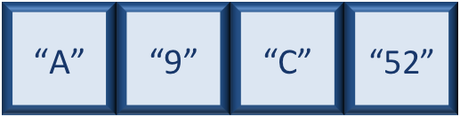
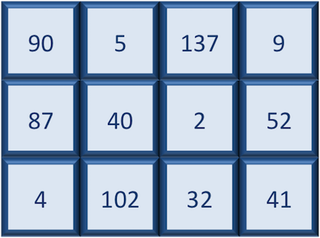

## Learning Objectives

* Remember basic R syntax
* Understand variables and the assignment operator in R
* Understand the various data types and data structures in R
* Understanding the structure of a function and how it is used

## The R syntax

Below is an example script highlighting the many different "parts of speech" for R (syntax):

  - the **comments** `#` and how they are used to document function and its content
  - **variables** and **functions**
  - the **assignment operator** `<-`
  - the `=` for **arguments** in functions

_NOTE: indentation and consistency in spacing is used to improve clarity and legibility_


## Assignment operator

To do useful and interesting things in R, we need to assign _values_ to
_variables_ using the assignment operator, `<-`.  For example, we can use the assignment operator to assign the value of `3 * 4` to `x` by executing:

```r
x <- 3 * 4
```

The assignment operator (`<-`) assigns **values on the right** to **variables on the left**. 

*In RStudio, typing `Alt + -` (push `Alt` at the same time as the `-` key) will write ` <- ` in a single keystroke.*
* For mac books push `option` (third key from left) and the `-` to write ` <- ` in a single keystroke.*

Note that the value of x is not printed, it's just stored. If you want to view the value, type `x` in the console. 

## Combine 

You can *c*ombine multiple elements into a vector with `c()`: 

```r
# create vector of 
prime <- c(2, 3, 5, 7, 11, 13)
```

```r
# multipy primes by 2 
primes * 2
```

All R statements where you create objects, assignment statements, have the same form: 

```
object_name <- value
```

When reading this code, say "object name gets value" in your head. 

The other piece to remember is R will ignore `#` for that line. This allows you to write comments, text that is ignored by R but readable by humans! As code gets more complex, comments can save you from figuring out what was done in the code and remember your train of thought at the time. 

## Object Names 

Object names must start with a letter and can only contain letters, numbers, _ , and.. You want your object names to be descriptive, so you’ll need to adopt a convention for multiple words. I recommend using snake_case, where you separate lowercase words with _.

```
i_use_snake_case
otherPeopleUseCamelCase
some.people.use.periods
And_aFew.People_RENOUNCEconvention
```

- Avoid names starting with a number (`2x` is not valid but `x2` is)
- Keep in mind that **R is case sensitive** (e.g., `genome_length` is different from `Genome_length`)
- Make your names explicit and not too long.
- Avoid names of fundamental functions in R (e.g., `if`, `else`, `for`, see [here](https://stat.ethz.ch/R-manual/R-devel/library/base/html/Reserved.html) for a complete list). In general, even if it's allowed, it's best to not use other function names (e.g., `c`, `T`, `mean`, `data`) as variable names. When in doubt
check the help to see if the name is already in use. 
- Avoid dots (`.`) within a variable name as in `my.dataset`. There are many functions
in R with dots in their names for historical reasons, but because dots have a
special meaning in R (for methods) and other programming languages, it's best to
avoid them. 
- Use nouns for object names and verbs for function names


## Data Types

A variable is a symbolic name for (or reference to) information. Therefore, variables can contain values of (6) specific types within R. The six **data types** that R uses include: 

* `"numeric"` for any numerical value 
* `"character"` for text values, denoted by using quotes ("") around value   
* `"integer"` for integer numbers (e.g., `2L`, the `L` indicates to R that it's an integer)
* `"logical"` for `TRUE` and `FALSE` (the boolean data type)
* `"complex"` to represent complex numbers with real and imaginary parts (e.g.,
  `1+4i`) and that's all we're going to say about them
* `"raw"` that we won't discuss further

The table below provides examples of each of the commonly used data types:

| Data Type  | Examples|
| -----------:|:-----------:|
| Numeric:  | 1, 1.5, 20, pi|
| Character:  | “anytext”, “5”, “TRUE”|
| Integer:  | 2L, 500L, -17L|
| Logical:  | TRUE, FALSE, T, F|

To check the data type use: 

```r
typeof("name")
```
## Data Structures

We know that variables are like buckets, and so far we have seen that bucket filled with a single value. Even when `number` was created, the result of the mathematical operation was a single value. **Variables can store more than just a single value, they can store a multitude of different data structures.** These include, but are not limited to, vectors (`c`), factors (`factor`), matrices (`matrix`), data frames (`data.frame`) and lists (`list`).


### Vectors

A vector is the most common and basic data structure in R, and is pretty much the workhorse of R. It's basically just a collection of values, mainly either numbers,



or characters,


or logical values,


**Note that all values in a vector must be of the same data type.** If you try to create a vector with more than a single data type, R will try to coerce it into a single data type. 

For example, if you were to try to create the following vector:


R will coerce it into:



The analogy for a vector is that your bucket now has different compartments; these compartments in a vector are called *elements*. 

Each **element** contains a single value, and there is no limit to how many elements you can have. A vector is assigned to a single variable, because regardless of how many elements it contains, in the end it is still a single entity (bucket). 

***

**Class Exercise**

Create one character vector and one numerical vector using the data of life expectancy below: 

| Animal | Years|
| ------:|:----:|
| Antarctic Sponge | 1550 | 
| Quahog | 400 |
| Bowhead Whale | 211 |
| Tortoise | 190 | 
| Human | 100 | 
| Elephant | 70 |
| Lobster | 50 |

*** 

### Matrix

A `matrix` in R is a collection of vectors of **same length and identical datatype**. Vectors can be combined as columns in the matrix or by row, to create a 2-dimensional structure.




### Data Frame

 A `data.frame` is similar to a matrix in that it's a collection of vectors of of the **same length** and each vector represents a column. However, in a dataframe **each vector can be of a different data type** (e.g., characters, integers, factors). 


A data frame is the most common way of storing data in R, and if used systematically makes data analysis easier. 

We can create a dataframe by bringing **vectors** together to **form the columns**. We do this using the `data.frame()` function, and giving the function the different vectors we would like to bind together. *This function will only work for vectors of the same length.*

***
**Class Exercise #2** 

1. Check that the structures of the vectors created for class-exercise-1 are the same length using `str(vector-name)`

2. If they are, create a dataframe. Assign the newly created dataframe to an object called `life_exp`  

*Note, if successful, you will be able to view your data.frame object by clicking on its name in the `Environment` window.*

***


## Functions and their arguments

### What are functions?

A key feature of R is functions. Functions are **"self contained" modules of code that accomplish a specific task**. Functions usually take in some sort of data structure (value, vector, dataframe etc.), process it, and return a result.

The general usage for a function is the name of the function followed by parentheses:

```r
function_name(input)

function_name(argument1 = value1, argument2 = value2, ...) 
```
The input(s) are called **arguments** which can include:

1. the physical object (any data structure) on which the function carries out a task 
2. specifications that alter the way the function operates (e.g. options)

```r
factorial(4)
```

Not all functions take arguments, for example:

```r
getwd()
```

If you don't specify a required argument when calling the function, you will either receive an error or the function will fall back on using a *default*. 

```r
factoral()

Error in factorial() : argument "x" is missing, with no default
```


#### Seeking help on arguments for functions

The best way of finding out this information is to use the `?` followed by the name of the function. Doing this will open up the help manual in the bottom right panel of RStudio that will provide a description of the function, usage, arguments, details, and examples: 

```r
?factorial
```	
Alternatively, if you are familiar with the function but just need to remind yourself of the names of the arguments, you can use:

```r
args(factorial)
```

Even more useful is the `example()` function. This will allow you to run the examples section from the Online Help to see exactly how it works when executing the commands. Let's try that for `round()`:

```r
example("factorial")
```

---

*This lesson has been developed by members of the teaching team at the [Harvard Chan Bioinformatics Core (HBC)](http://bioinformatics.sph.harvard.edu/). These are open access materials distributed under the terms of the [Creative Commons Attribution license](https://creativecommons.org/licenses/by/4.0/) (CC BY 4.0), which permits unrestricted use, distribution, and reproduction in any medium, provided the original author and source are credited.*

* *The materials used in this lesson were derived from work that is Copyright © Data Carpentry (http://datacarpentry.org/). 
All Data Carpentry instructional material is made available under the [Creative Commons Attribution license](https://creativecommons.org/licenses/by/4.0/) (CC BY 4.0).*


