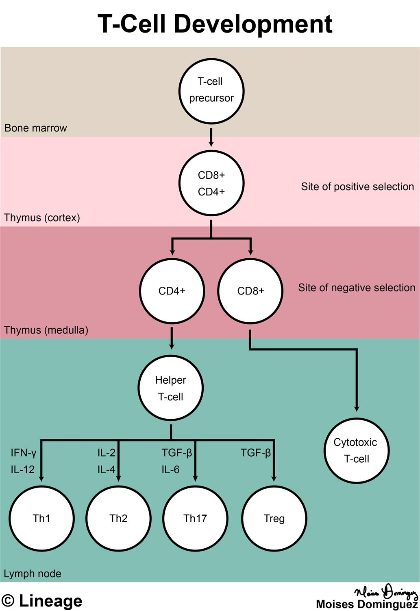
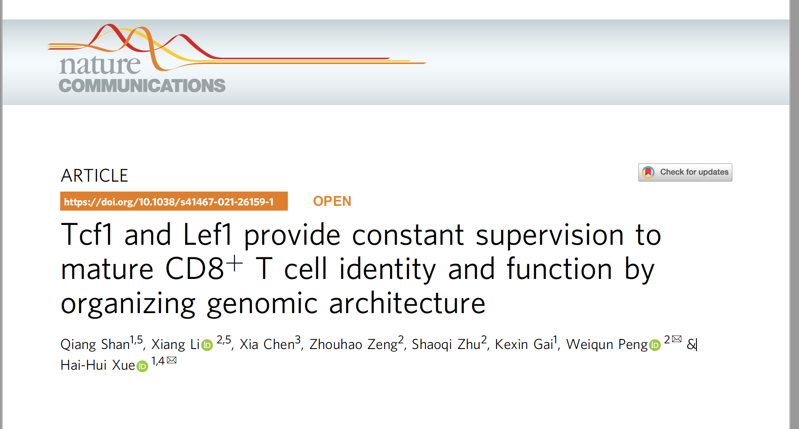
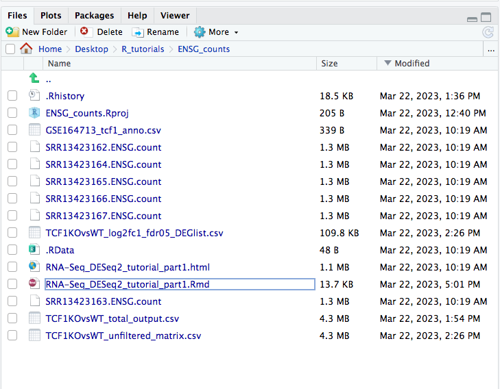

# The dataset 

For today's lesson we will be working with RNA-seq data from a recent publication in Nature Communications by [Shan et al. (2021)](https://doi.org/10.1038/s41467-021-26159-1). Before spring break, our final end product was the creation of counts files using HTSeq-count. Now, we will learn how to analyze this dataset in R. Our overall goal is to **identify a list of genes that are statistically distinct between the groups being compared**. This sounds easy right? Why not just do a log2FC with Microsoft Excel? The problem is, the **gene expression changes** we observe are not just a result of the differences between the groups that we are investigating, rather it **is a measurement of the sum of many effects**. In a set of biological samples the transcriptional patterns can be associated not only with our experimetal variable(s) but also many extraneous factors; some that we are aware of (i.e demographic factors, batch information) and sources that are unknown. The goal of differential expression analysis to determine the relative role of these effects, and to **separate the “interesting” from the “uninteresting”.** We will perform this differential analysis using DESeq2. 

## The publication
 
 T cell identity is established during thymic development, but how it is maintained in the periphery remains unknown. 
 
 <p align="center">

</p>
 
 The authors in this paper discover that by ablating Tcf1 and Lef1 transcription factors in mature CD8+ T cells this induces the expression of genes from non-T cell lineages. We will focus on analyzing the Tcf7 dataset. Specifically, Tcf7 fl/fl mice were crossed with hCD2-Cre mice to create mature CD8+ T cells that lacked *Tcf7*. The protein coded by *Tcf7* is Tcf1. 

<p align="center">

</p>


### The figures we will create and interpret 

* **PCA & correlation heatmap** to show clusters of samples based on their similarity 
* **Box plots** to show expression (normalized counts) of select genes 
* **Heatmap** to show the expression of the significantly up- and down-regulated genes in the Tcf7 knock-out (KO)  versus the wildtype (WT) 
* **Volcano plots** (essentially a scatter plot) to show the significance (adjusted p-value) and magnitude (log2FoldChange) of expression change between the WT samples versus the Tcf7 KO samples 
* **Pathway analysis** to show the relevant pathways that are associated with up and down-regulated genes. 

# Getting Started 

Copy this folder into your home directory:

```bash 
/gpfs1/cl/mmg232/course_materials/R_tutorials/
```
Once downloaded, navigate into the `ENSG_counts` folder located within R_tutorials: 
<p align="center">

</p>

Then click on the file RNA-Seq_DESeq2_tutorial_part1.Rmd to open: 
<p align="center">

</p>


## Install the following packages if you need to!  

You will see an image like this if you are missing any packages required to run the .Rmd file 

- knitr
- DESeq2 
- RColorBrewer
- pheatmap
- ggplot2
- tidyverse

## Load the following libraries 

```{r}
library(knitr)
library(DESeq2)
library(RColorBrewer)
library(pheatmap)
library(ggplot2)
library(tidyverse)
```

## Citation 

Shan, Q., Li, X., Chen, X. et al. Tcf1 and Lef1 provide constant supervision to mature CD8+ T cell identity and function by organizing genomic architecture. Nat Commun 12, 5863 (2021). https://doi.org/10.1038/s41467-021-26159-1

*This lesson has been developed by members of the teaching team at the [Harvard Chan Bioinformatics Core (HBC)](http://bioinformatics.sph.harvard.edu/). These are open access materials distributed under the terms of the [Creative Commons Attribution license](https://creativecommons.org/licenses/by/4.0/) (CC BY 4.0), which permits unrestricted use, distribution, and reproduction in any medium, provided the original author and source are credited.*
