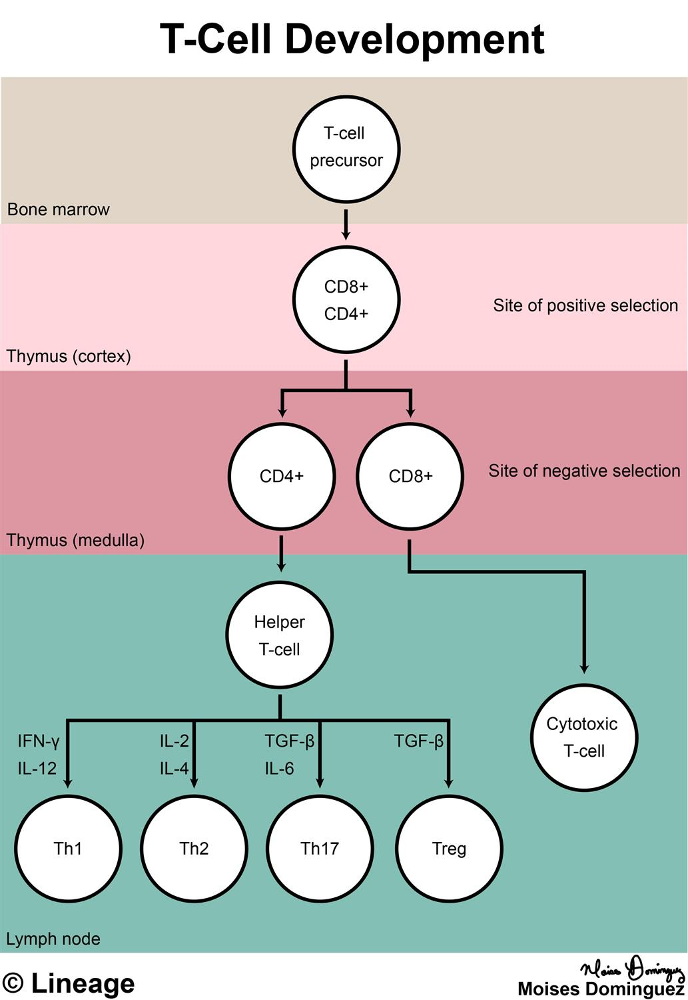

## Getting Started 

Copy this folder into your home directory:

```bash 
/gpfs1/cl/mmg3320/course_materials/R_tutorials/GSEA_CE
```

## Install the following packages if you need to:   

```
library(clusterProfiler)
library(dplyr)
library(msigdbr) # BiocManager::install("msigdb")
library(pathview)
library(enrichplot) # BiocManager::install("enrichplot")
library(DOSE)
```

***

### Reminder: The dataset we are analyzing 

For today's lesson we will be working with RNA-seq data from a recent publication in Nature Communications by [Shan et al. (2021)](https://doi.org/10.1038/s41467-021-26159-1). Before spring break, our final end product was the creation of counts files using HTSeq-count. 

Our overall goal is to **identify a list of genes that are statistically distinct between the groups being compared**. This sounds easy right? So why not just do a log2FC with Microsoft Excel? The problem is, the **gene expression changes** we observe are not just a result of the differences between the groups that we are investigating, rather it **is a measurement of the sum of many effects**. In a set of biological samples the transcriptional patterns can be associated not only with our experimetal variable(s) but also many extraneous factors; some that we are aware of (i.e demographic factors, batch information) and sources that are unknown. The goal of differential expression analysis to determine the relative role of these effects, and to **separate the “interesting” from the “uninteresting”.** We will perform this differential analysis using DESeq2 in R. 

### The publication
 
 T cell identity is established during thymic development, but how it is maintained in the periphery remains unknown. 
 
 <p align="center">

</p>
 
 The authors in this paper discover that by ablating Tcf1 and Lef1 transcription factors in mature CD8+ T cells this induces the expression of genes from non-T cell lineages. We will focus on analyzing the Tcf7 dataset. Specifically, Tcf7 fl/fl mice were crossed with hCD2-Cre mice to create mature CD8+ T cells that lacked *Tcf7*. The protein coded by *Tcf7* is Tcf1. 

<p align="center">

</p>


### Citation 
Shan, Q., Li, X., Chen, X. et al. Tcf1 and Lef1 provide constant supervision to mature CD8+ T cell identity and function by organizing genomic architecture. Nat Commun 12, 5863 (2021). https://doi.org/10.1038/s41467-021-26159-1

