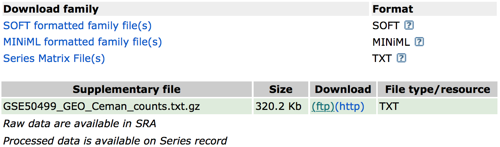

## Learning Objectives:

* Understand the type of data that is accessible from Gene Expression Omnibus (GEO)
* Demonstrate how to navigate the GEO website and FTP server
* Use the command-line interface to copy over data from GEO

# Accessing public NGS sequencing data

All types of next-generation sequencing (NGS) analyses require access to public data, regardless of whether we are analyzing our own data or the data output from someone else's experiment. Reference data is available online as well as the experimental data from many published (and unpublished) studies. To access this data required a basic knowledge of **command line** *(Unit 1 - MMG232) and an understanding about the **associated tools and databases** (MMG231).

To find and download NGS experimental data and associated reference data, we will explore several different repositories. For **accessing experimental data**, we will explore the [Gene Expression Omnibus](https://www.ncbi.nlm.nih.gov/geo/) and the [Sequence Read Archive](https://www.ncbi.nlm.nih.gov/sra) repositories. For **finding reference data**, we will navigate the [Ensembl database](http://useast.ensembl.org/index.html), [iGenomes](https://support.illumina.com/sequencing/sequencing_software/igenome.html) and [Wormbase](https://wormbase.org). We will focus on these repositories; however, other databases are also useful for exploring and downloading experimental and reference data, including [UCSC Table Browser](https://genome.ucsc.edu/cgi-bin/hgTables) and the [NCBI Genome](https://www.ncbi.nlm.nih.gov/genome/), and I encourage you to explore these more on your own.

# Gene Expression Omnibus

To find public experimental sequencing data, the NCBI's Gene Expression Omnibus (GEO) website is a useful place to search. The requirement for many grants is that experimental data be uploaded to GEO and the sequence read archive (SRA); therefore, there are quite a few datasets on GEO available to search. The interface for finding data on GEO is relatively user-friendly and easily searchable.

## Finding and accessing data on GEO

### Searching GEO

To search GEO for particular types of data is relatively straight forward. Once on the [GEO website](https://www.ncbi.nlm.nih.gov/geo/) there are multiple different options for searching datasets. 

The most straight-forward method can be found by clicking on 'Datasets' under the 'Browse Content' column. 

The 'Datasets' link will open the GEO Dataset Browser; click on 'Advanced Search'.

All results will appear in a new window with clickable filters on the left-hand side. You can choose the filters, such as 'Organism' (human, mouse), 'Study type' (Expression profiling by high throughput sequencing), 'Publication dates' (1 year), etc. to filter the data for the desired attributes.

### Finding GEO data for a particular publication

However, you will be finding data from a published paper on GEO. **The paper will provide the GEO accession number.** For example, let's find the data associated with the paper, "MOV10 and FRMP regulate AGO2 association with microRNA recognition elements". First, we can navigate to the [article](https://www.ncbi.nlm.nih.gov/pmc/articles/PMC4268400/).

Then, we can search for the term **"GEO"**; different papers have different requirements for where this information is located. In this article, it is available in a separate section entitled "Accession Numbers".

By clicking on the GEO accession number for the experiment of interest, the GEO page for this experiment will open.

The GEO page contains information about the experiment, including:
	
- an experimental summary: gives you an understanding of *how* the experiment was performed. 
- literature citation
- contact information
- links to the Sample GEO pages: each sample will have its own page with additional information regarding how the sample was generated and analyzed 
- link to the SRA project containing the raw FASTQ files

### **Remember, that you may be selecting a paper with multiple GEO accession numbers. This may be due to the authors analyzing a dataset generated from one or more other research groups. It is your responsibility to read the GEO page carefully prior to selecting a paper for downstream analysis.**  

In addition, if we were interested in **downloading the raw counts matrix (`GSE50499_GEO_Ceman_counts.txt.gz`)**, which gives the number of reads/sequences aligning to each gene, then we could scroll down to **supplementary data** at the bottom of the page. 

We could download this file by clicking on the `ftp` link. In addition to the counts matrix file, we would probably also want the metadata for the file to know which sample belongs to which conditions by clicking on the "Series Matrix File(s)" link. 

So yes, technically - you can skip the processing steps and just proceed with using the counts matrix created for you. But beware of the following: 

- This assumes the authors have aligned to the latest reference genome 
- It assumes you completely understand the bioinformatic pipeline used and that it is still acceptable to current standards 
- You will be missing out on the experience to process the dataset yourself and troubleshoot as you go. This experience is very valuable for *bioinformaticians-in-training* and gives you a space to troubleshoot with someone. Don't waste it because this may be the only time you will have to work with someone through data processing. 

> **NOTE:** The "Series Matrix" metadata file is a bit congested, and it may be easier accessing the metadata from the SRA instead as discussed later.

# 

---
*This lesson has been developed by members of the teaching team at the [Harvard Chan Bioinformatics Core (HBC)](http://bioinformatics.sph.harvard.edu/). These are open access materials distributed under the terms of the [Creative Commons Attribution license](https://creativecommons.org/licenses/by/4.0/) (CC BY 4.0), which permits unrestricted use, distribution, and reproduction in any medium, provided the original author and source are credited.*
