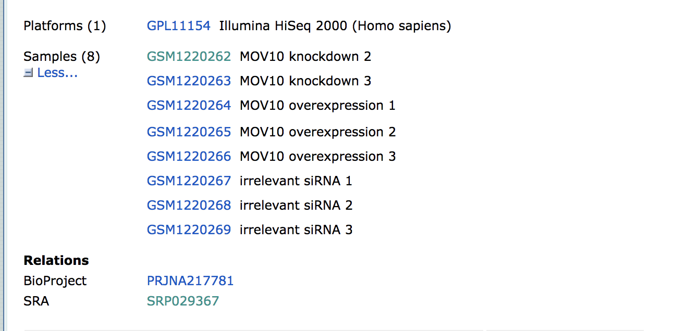

# Learning Objectives:

* Understand the type of data that is accessible from Gene Expression Omnibus (GEO)
* Use the command-line interface to copy over data from GEO

# Accessing public NGS sequencing data

All types of next-generation sequencing (NGS) analyses require access to public data, regardless of whether we are analyzing our own data or the data output from someone else's experiment. Reference data is available online as well as the experimental data from many published (and unpublished) studies. To access this data required a basic knowledge of **command line** *(Unit 1 - MMG232) and an understanding about the **associated tools and databases** (MMG231).

To find and download NGS experimental data and associated reference data, we will explore a few key repositories. For **accessing experimental data**, we will explore the [Gene Expression Omnibus](https://www.ncbi.nlm.nih.gov/geo/) and the [Sequence Read Archive](https://www.ncbi.nlm.nih.gov/sra) repositories. For **finding reference data**, we will navigate the [Ensembl database](http://useast.ensembl.org/index.html). We will focus on these repositories; however, other databases are also useful for exploring and downloading experimental and reference data, including [UCSC Table Browser](https://genome.ucsc.edu/cgi-bin/hgTables) and the [NCBI Genome](https://www.ncbi.nlm.nih.gov/genome/), and I encourage you to explore these more on your own.

# Gene Expression Omnibus

To find public experimental sequencing data, the NCBI's Gene Expression Omnibus (GEO) website is a useful place to search. The requirement for many grants is that experimental data be uploaded to GEO and the sequence read archive (SRA); therefore, there are quite a few datasets on GEO available to search. The interface for finding data on GEO is relatively user-friendly and easily searchable.

## Finding and accessing data on GEO

### Searching GEO

To search GEO for particular types of data is relatively straight forward. Once on the [GEO website](https://www.ncbi.nlm.nih.gov/geo/) there are multiple different options for searching datasets. 


The most straight-forward method can be found by clicking on 'Datasets' under the 'Browse Content' column. 


The 'Datasets' link will open the GEO Dataset Browser; click on 'Advanced Search'.


All results will appear in a new window with clickable filters on the left-hand side. You can choose the filters, such as 'Organism' (human, mouse), 'Study type' (Expression profiling by high throughput sequencing), 'Publication dates' (1 year), etc. to filter the data for the desired attributes.


### Finding GEO data for a particular publication

However, you will be finding data from a published paper on GEO. **The paper will provide the GEO accession number.** For example, let's find the data associated with the paper, "MOV10 and FRMP regulate AGO2 association with microRNA recognition elements". First, we can navigate to the [article](https://www.ncbi.nlm.nih.gov/pmc/articles/PMC4268400/).


Then, we can search for the term **"GEO"**; different papers have different requirements for where this information is located. In this article, it is available in a separate section entitled "Accession Numbers".


By clicking on the GEO accession number for the experiment of interest, the GEO page for this experiment will open.


The GEO page contains information about the experiment, including:
	
- an experimental summary: gives you an understanding of *how* the experiment was performed. 
- literature citation
- contact information
- links to the Sample GEO pages: each sample will have its own page with additional information regarding how the sample was generated and analyzed 
- link to the SRA project containing the raw FASTQ files

### **Remember, that you may be selecting a paper with multiple GEO accession numbers. This may be due to the authors analyzing a dataset generated from one or more other research groups. It is your responsibility to read the GEO page carefully prior to selecting a paper for downstream analysis.**  

In addition, if we were interested in **downloading the raw counts matrix (`GSE50499_GEO_Ceman_counts.txt.gz`)**, which gives the number of reads/sequences aligning to each gene, then we could scroll down to **supplementary data** at the bottom of the page. 

We could download this file by clicking on the `ftp` link. In addition to the counts matrix file, we would probably also want the metadata for the file to know which sample belongs to which conditions by clicking on the "Series Matrix File(s)" link. 

So yes, technically - you can skip the processing steps and just proceed with using the counts matrix created for you. But beware of the following: 

- This assumes the authors have aligned to the latest reference genome 
- It assumes you completely understand the bioinformatic pipeline used and that it is still acceptable to current standards 
- You will be missing out on the experience to process the dataset yourself and troubleshoot as you go. This experience is very valuable for *bioinformaticians-in-training* and gives you a space to troubleshoot with someone. Don't waste it because this may be the only time you will have to work with someone through data processing. 

> **NOTE:** The "Series Matrix" metadata file is a bit congested, and it may be easier accessing the metadata from the Sequence Read Archive(SRA) instead as discussed later.


# Downloading data from SRA 

The Sequence Read Archive (SRA) is an archive for high throughput sequencing data, publically accessible, for the purpose of enhancing reproducibility in the scientific community.

There are four hierarchical levels of SRA entities and their accessions:  

1. **STUDY** with accessions in the form of SRP, ERP, or DRP  
2. **SAMPLE** with accessions in the form of SRS, ERS, or DRS  
3. **EXPERIMENT** with accessions in the form of SRX, ERX, or DRX  
4. **RUN** with accessions in the form of SRR, ERR, or DRR

The minimum publishable unit in the SRA, is an EXPERIMENT (SRX)


Since most studies include multiple samples and a high number of replicates, it is useful to know how to download all the sequencing runs from all samples in a study, without having to hunt down and type in individual SRR numbers one by one. Using the study accession number as previously shown, we can navigate to the summary page for the study. 


Towards the bottom of the page you will find a link for "SRA" under the heading "Relations".



Clicking on this link takes you to a page that lists all the biological samples for the study - each with a link to their specific runs and files. If we were only interested in one sample, we could follow the relevant link and find its runs. But generally we want the files for all samples and their replicates, and to find this in one comprehensive list, we use the **run selector**. Navigate to the bottom of the page and click "send to" and click the radio button for "run selector", and then press "go".


## Run selector
You'll notice that the run selector has aggregated all the information for the study samples, including a table of metadata at the top, giving information on: 
+ LibraryLayout - whether the reads were sequenced using single or paired end sequencing
+ Platform - which sequencing technology was used 
+ Organism 
+ Instrument 
+ Cell type/ tissue type
... and other useful information that should be noted for downstream analysis.


Below this there is also a summary line detailing the total number of runs in the study. Let's pause here. Notice that every sample (ex. GSM1220262, GSM1220263, etc.) has two Run accession numbers associated with it. 


Another way to view this:   


To fully understand what this means, we need to go back to the GEO page for this [sample](https://www.ncbi.nlm.nih.gov/geo/query/acc.cgi?acc=GSM1220262) and then navigate to the SRA page. Notice that these samples were submitted for sequencing twice. Therefore, for a single sample, there will be double the amount of sequencing files to process. 

Next, let's download the RunInfoTable and Accession List in text format. The RunInfoTable is a very useful text summary of all metadata for all runs in the study, and the Accession List is a list of all the SRR accession numbers for the study.

Also on this page is a listing of each run and the corresponding sample it came from, as well as its associated metadata. This table is useful in that each row is "clickable", which allows you to select a subset of runs that you may be interested in. You'll notice that clicking a subset of runs spawns a new download option - a RunInfoTable & Accession List that is only relevant to your chosen subset.

Download the Accession list for the data you are interested in to your desktop. Then create a replicate of the Accession List on the VACC - call this file list_of_SRRs.txt

## Download SRA-toolkit 

We will be installing SRA tookit using the instructions found [here](https://github.com/ncbi/sra-tools/wiki/02.-Installing-SRA-Toolkit). 

1. Make a directory in your VACC account and call is `software`   

2. Next, you will retrieving the program package sratoolkit using the wget command. Be sure to download this package WITHIN your software directory.   

    ```
    wget --output-document sratoolkit.tar.gz https://ftp-trace.ncbi.nlm.nih.gov/sra/sdk/current/sratoolkit.current-ubuntu64.tar.gz
    ```
The result should produce an output similar to:  
  


3. The contents within this file need to be extracted. Notice the .tar.gz extension. This TAR is used to package files together for distribution or backup purposes.   

    ```bash
    tar -vxzf sratoolkit.tar.gz
    ```
The result should produce an output similar to:  


4. Add the PATH to environment variable. This is a multi-part step.   

    ```
    nano .bash_profile
    ```

Now that you have accessed your bash profile, add the path to the `bin` folder for `sratoolkit.3.0.1-ubuntu64`. Below is showing the entire PATH for **MY account** - yours will have **YOUR user name.** After you add the PATH, then save.  

    ```
    export PATH=$PATH:/users/p/d/pdrodrig/software/sratoolkit.3.0.1-ubuntu64/bin
    ```

The result should produce an output similar to:  


To make sure your changes take place, perform the following: 

    ```
    source .bash_profile
    ```


5. Verify the binaries will be found by the shell:  

    ```bash
    which fastq-dump
    ```

The result should produce an output similar to:

    ```
    /Users/JoeUser/sratoolkit.3.0.0-mac64/bin/fastq-dump
    ```
6. Configure sratoolkit. This is a multi-part step 

    ```
    cd ~
    cd scratch/
    mkdir tmp
    ```
Navigate back to sratoolkit.3.0.0-mac64/bin:

    ```
    vdb-config -i
    ```
Use Tab to navigate around 
MAIN
[X] Enable Remote Access

hit return to move into `CACHE`
CACHE

location of user-repository - hit `o`. Navigate to the `tmp` directory hit Ok  
  

Then save changes   
  

7. Test that the toolkit if functional  

    ```
    fastq-dump --stdout -X 2 SRR390728
    ```

Within a few seconds, the command should produce this exact output: 

    ```
    Read 2 spots for SRR390728
    Written 2 spots for SRR390728
    @SRR390728.1 1 length=72
    CATTCTTCACGTAGTTCTCGAGCCTTGGTTTTCAGCGATGGAGAATGACTTTGACAAGCTGAGAGAAGNTNC
    +SRR390728.1 1 length=72
    ;;;;;;;;;;;;;;;;;;;;;;;;;;;9;;665142;;;;;;;;;;;;;;;;;;;;;;;;;;;;;96&&&&(
    @SRR390728.2 2 length=72
    AAGTAGGTCTCGTCTGTGTTTTCTACGAGCTTGTGTTCCAGCTGACCCACTCCCTGGGTGGGGGGACTGGGT
    +SRR390728.2 2 length=72
    ;;;;;;;;;;;;;;;;;4;;;;3;393.1+4&&5&&;;;;;;;;;;;;;;;;;;;;;<9;<;;;;;464262
    ```

## Environment Variables

Environment variables are, in short, variables that describe the environment in which programs run, and they are predefined for a given computer or cluster that you are on. You can reset them to customize the environment. 

In this lesson, we are going to focus on two most commonly encountered environment variables: `$HOME` and `$PATH`.

* `$HOME` defines the full path for the home directory of a given user.
* `$PATH` defines a list of directories to search in when looking for a command/program to execute.

Environment variables, in most systems, are called or denoted with a "$" before the variable name, just like a regular variable. Let's use the `echo` command to see what is stored in `$HOME`:

```bash
echo $HOME
```

You should see the path to your home directory. `$HOME` can be used instead of the `~` (if you want to type 4 more characters).


`$HOME` is pretty straightforward, how about we take a look at what is stored in the `$PATH` variable:

```bash
echo $PATH

/users/m/m/mmg232in/miniconda3/condabin:/gpfs1/arch/spack-0.14.2/bin:/usr/local/bin:/usr/bin:/usr/local/sbin:/usr/sbin:/var/cfengine/bin:/usr/lpp/mmfs/bin:/opt/env-switcher/bin:/users/m/m/mmg232in/.local/bin:/users/m/m/mmg232in/bin:/users/m/m/mmg232in/software/sratoolkit.3.0.1-ubuntu64/bin
```
This output is a lot more complex! Let's break it down. When you look closely at the output of `echo $PATH`, you should a list of full paths separated from each other by a ":". 

Here is the list of paths in a more readable format:
* `miniconda3/condabin`
* `/local/sbin`
* `/cfengine/bin`
* `/env-switcher/bin`
* `/usr/local/rvm/rubies/ruby-2.4.9/bin`
* `sratoolkit.3.0.1-ubuntu64/bin`

Each of these paths are referring to a directory, in this case a lot of them are named `bin`. 

### What are all these paths? And what do they represent?

These are the directories that the shell will look through (in the same order as they are listed) for any given command or executable file that you type on the command prompt.

**The path `/usr/bin` is usually where executables for commonly used commands are stored.**

> As pointed out earlier, a lot of the folders listed in the `$PATH` variable are called `bin`. This is because of a convention in Unix to call directories that contain all the commands (in ***binary*** format) **`bin`**.

***

#### Modifying Environment Variables

You can modify the contents of the `$PATH` environment variable with the `export` command. 

The `export` command:
* Example `export PATH=$PATH:~/opt/bin` (**do not run this**)
* The arguments or **input to `export` should always include `$PATH`**
  * This specifies that you want to maintain the existing contents.
  
This is often used to add paths to a directory with commands you commonly want to use. 

Let's say you often use the `fastq-dump`  

Without setting up your environmental variable, every time you want to run this tool you will need to type the following:

```bash 
/users/m/m/mmg232in/software/sratoolkit.3.0.1-ubuntu64/bin/fastq-dump <inputfile>
```

However, if `/users/m/m/mmg232in/software/sratoolkit.3.0.1-ubuntu64/bin` is part of the `$PATH` variable you can instead just type:

```bash
fastq-dump <inputfile>
```

## Using SRA-toolkit to download multiple SRR files 
Unfortunately, since the SRA-toolkit doesn't have its own methods for downloading multiple SRR files at once in parallel. Lucky for us, the people at Harvard wrote a two scripts to do this for us. These scripts are located here: 
 
```
cp -r /gpfs1/cl/mmg232/course_materials/download_from_SRA .
```

The first script is a loop, which goes through your list of SRR's, and calls a second script at each iteration, passing it an SRR number in the list.

```bash
nano sra_fqdump.sh
```
```bash
#!/bin/bash
#SBATCH --partition=bluemoon
#SBATCH --nodes=1
#SBATCH --ntasks=2
#SBATCH --mem=50G
#SBATCH --time=30:00:00
#SBATCH --job-name=fastq 
# %x=job-name %j=jobid
#SBATCH --output=%x_%j.out

#while there are lines in the list of SRRs file
while read p
do
#call the bash script that does the fastq dump, passing it the SRR number next $
sbatch inner_script.sh $p
done <list_of_SRRs.txt
```
The script that is called inside the loop (inner_script.sh) is the one that takes the given SRR number and runs fastq-dump on it:

```bash
nano inner_script.sh
```

```bash
#!/bin/bash
#SBATCH --partition=bluemoon
#SBATCH --nodes=1
#SBATCH --ntasks=2
#SBATCH --mem=50G
#SBATCH --time=30:00:00
#SBATCH --job-name=fastq
# %x=job-name %j=jobid
#SBATCH --output=%x_%j.out

#for single end reads only
fastq-dump --gzip $1
```

In this way (by calling a script within a script) we will start a new job for each SRR download, and in this way download all the files at once in parallel -- much quicker than if we had to wait for each one to run sequentially. To run the main script:

```bash
sbatch sra_fqdump.sh
```

### Paired end files
An important thing to note before you start the download of your files, is the **LibraryLayout** information (found in the RunInfoTable) - ie: whether your data is single or paired end. Unlike the standard format for paired end data, where we normally find two fastq files labelled as sample1_001.fastq and sample1_002.fastq, SRR files can be very misleading in that even paired end reads are found in one single file, with sequence pairs concatenated alongside each other. Because of this format, paired files need to be split at the download step. SRA toolkit has an option for this called "--split-files". By using this, one single SRR file will download as SRRxxx_1.fastq and SRRxxx_2.fastq.

Furthermore, there is a very helpful improvement on this function called "--split-3" which splits your SRR into 3 files: one for read 1, one for read 2, and one for any orphan reads (ie: reads that aren't present in both files). This is important for downstream analysis, as some aligners require your paired reads to be in sync (ie: present in each file at the same line number) and orphan reads can throw this order off. Change the inner_script.sh as follows if your reads are paired end:

```bash
#!/bin/bash
#SBATCH --partition=bluemoon
#SBATCH --nodes=1
#SBATCH --ntasks=2
#SBATCH --mem=50G
#SBATCH --time=30:00:00
#SBATCH --job-name=fastq
# %x=job-name %j=jobid
#SBATCH --output=%x_%j.out

#splits paired read sra files into two normal fastq files plus a third for any orphaned reads, to keep paired files in sync
fastq-dump --split-3  $1
```

### Bypassing storage issues
Another important consideration when downloading large datasets to the server, is the maximum storage limit in your location. If you are downloading files to your home directory, the maximum allowed storage is 100GB. This can be a problem when downloading tens or hundreds of fastq files, as SRA-toolkit does not download the fastq files directly but writes an intermediate (equally large) cache file first, which is not removed. Because of this, you may run into storage errors very quickly, and will notice your files not downloading completely, and storage errors writing to your run.e error file. If this is the case, the scratch space on O2 (/n/scratch2) is a location with much greater storage (12TB limit), and a better place to run large downloads. 


## Citation 

*This lesson has been developed by members of the teaching team at the [Harvard Chan Bioinformatics Core (HBC)](http://bioinformatics.sph.harvard.edu/). These are open access materials distributed under the terms of the [Creative Commons Attribution license](https://creativecommons.org/licenses/by/4.0/) (CC BY 4.0), which permits unrestricted use, distribution, and reproduction in any medium, provided the original author and source are credited.*
