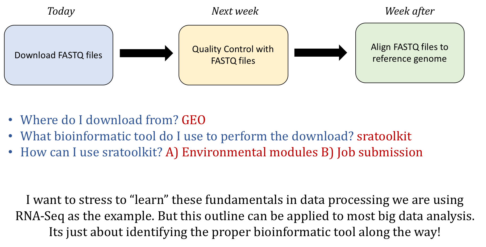
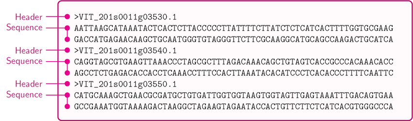
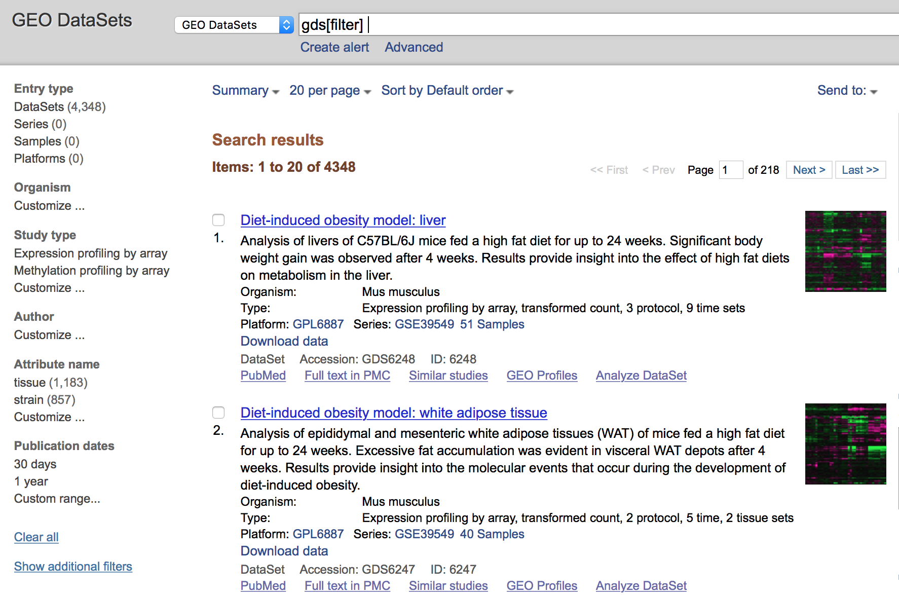
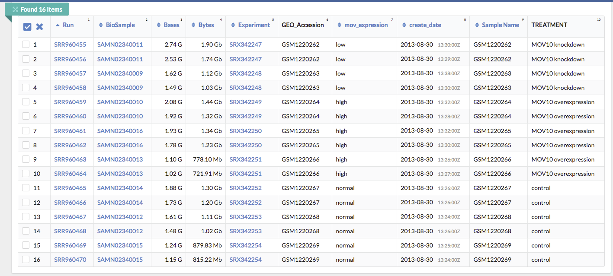

# Accessing Public Data

## Learning Objectives

* Understand the types of data that is accessible from Gene Expression Omnibus (GEO)
* Use the command-line interface to copy over data from GEO

## Where we are going?

<p align="center">

</p>

## Accessing genomic reference data

### FASTA
During an NGS experiment, the nucleotide sequences stored inside the raw FASTQ files, or "sequence reads", need to be mapped or aligned to the reference genome to determine from where these sequences originated. Therefore, we need a reference genome (in FASTA format) in which to align our sequences.

<p align="center">

</p>

### GTF 
In addition, many NGS methods require knowing where known genes or exons are located on the genome in order to quantify the number of reads aligning to different genome features, such as exons, introns, transcription start sites, etc. These analyses require reference data containing specific information about genomic coordinates of various genomic “features”, such as gene annotation files (in GTF, GFF, etc.). 

<p align="center">

</p>

To download reference data, there are a few different sources available:

- **General biological databases:** Ensembl, NCBI, and UCSC
- **Organism-specific biological databases:** Wormbase, Flybase, Cryptodb, etc. (often updated more frequently, so may be more comprehensive)

*Note that these reference data sources are relevant to most types of genomic analyses not just NGS analyses.

To find and download NGS experimental data and associated reference data we will explore a few key repositories. For **finding reference data**, we will navigate the [Ensembl database](http://useast.ensembl.org/index.html). For **accessing experimental data**, we will explore the [Gene Expression Omnibus](https://www.ncbi.nlm.nih.gov/geo/) and the [Sequence Read Archive](https://www.ncbi.nlm.nih.gov/sra) repositories. 

<p align="center">

</p>

## General biological databases

Biological databases for gene expression data store genome assemblies and provide annotations regarding where the genes, transcripts, and other genomic features are located on the genome. 

Genome assemblies give us the **nucleotide sequence of the reference genome**. Although the Human Genome Project was "completed" in 2003, small gaps in the sequence remained (estimated 1% of gene-containing portions). As technology improves and more genomes are sequenced, these gaps are filled, mistakes are corrected and alternate alleles are provided. Therefore, every several years a **new genome build** is released that contains these improvements. 

The **current genome build** is GRCh38/hg38 for the human, which was released in 2013 and is maintained by the Genome Reference Consortium (GRC). 

<p align="center">

</p>

Usually the biological databases will include the updated versions as soon as they are stably released, in addition to access to archived versions.

Genome databases incorporate these genomes and generate the gene annotations with the following **similarities/differences**:

- **Ensembl, NCBI, and UCSC** all use the **same genome assemblies or builds** provided by the GRC
	- GRCh38 = hg38; GRCh37 = hg19

- Each biological database **independently determines the gene annotations**; therefore, gene annotations between these databases can differ, even though the genome assembly is the same. Naming conventions are also different (chr1=1) between databases.

- **Always use the same biological database for all reference data!**

### Ensembl

[*Ensembl*](http://useast.ensembl.org/index.html) provides a website that acts as a **single point of access to annotated genomes** for vertebrate species. For all other organisms there are additional Ensembl databases available through [Ensembl Genomes](http://ensemblgenomes.org/); however, they do not include viruses (NCBI does).

- Genome assemblies/builds (reference genomes)
	- New genome builds are released every several years or more depending on the species
	- Genome assemblies are updated every two years to include patches, or less often depending on the species

- Gene annotations
	- Gene annotations are created or updated using a variety of sources (ENA, UniProtKB, NCBI RefSeq, RFAM, miRBase, and tRNAscan-SE databases)
	- Automatic annotation is performed for all species using identified proteins and transcripts
	- Manual curation by the HAVANA group is performed for human, mouse, zebrafish, and rat species, providing better confidence of transcript annotations
	- Directly imports annotations from FlyBase, WormBase and SGD

### Using the Ensembl genomic database and genome browser

Navigate to the [Ensembl website](http://useast.ensembl.org/index.html) to view the interface. The homepage for Ensembl has a lot to offer, with the a lot of information and access to a range of functionality and tools.

<p align="center">
  
</p>

- **Searching Ensembl**:  Look for a gene, location, variant and more using the search box on the homepage or the box that is provided in the top right corner of any Ensembl page.

	- a gene name (for example, BRCA2) - best to use the official gene symbols ([HGNC](http://www.genenames.org))
	- a UniProt accession number (for example, P51587)
	- a disease name (for example, coronary heart disease)
	- a variation (for example, rs1223)
	- a location - a genomic region (for example, rat X:100000..200000)
	- a PDB ID or a Gene Ontology (GO) term

	Most search results will take you to the appropriate Ensembl view through a results page. These linked pages will allow you to **download information/sequences for specific genes/transcripts/exons/variants**. If you search using a location you will be directed straight to the location tab (this tab provides a view of a region of a genome). 

- **Ensembl identifiers**: When using Ensembl, note that it uses the following format for biological identifiers:
	
    - **ENSG###########:**	Ensembl Gene ID
    - **ENST###########:**	Ensembl Transcript ID
    - **ENSP###########:**	Ensembl Peptide ID
    - **ENSE###########:**	Ensembl Exon ID
	
    For non-human species a suffix is added:

    - **ENSMUSG###:** MUS (Mus musculus) for mouse 
    - **ENSDARG###:** DAR (Danio rerio) for zebrafish

- **Downloading reference data from Ensembl**: Go to Downloads, then click FTP Download on the left side bar. 

<p align="center">

</p>

# Accessing public NGS sequencing data 

## Gene Expression Omnibus (GEO)

To find public experimental sequencing data, the NCBI's Gene Expression Omnibus (GEO) website is a useful place to search. The requirement for many grants is that experimental data be uploaded to GEO and the sequence read archive (SRA); therefore, there are quite a few datasets on GEO available to search. The interface for finding data on GEO is relatively user-friendly and easily searchable.

## Finding and accessing data on GEO

### Searching GEO

To search GEO for particular types of data is relatively straight forward. Once on the [GEO website](https://www.ncbi.nlm.nih.gov/geo/) there are multiple different options for searching datasets. 


The most straight-forward method can be found by clicking on 'Datasets' under the 'Browse Content' column. 


The 'Datasets' link will open the GEO Dataset Browser; click on 'Advanced Search'.


All results will appear in a new window with clickable filters on the left-hand side. You can choose the filters, such as 'Organism' (human, mouse), 'Study type' (Expression profiling by high throughput sequencing), 'Publication dates' (1 year), etc. to filter the data for the desired attributes.



### Finding GEO data for a particular publication

However, you will be finding data from a published paper on GEO. **The paper will provide the GEO accession number.** For example, let's find the data associated with the paper, "MOV10 and FRMP regulate AGO2 association with microRNA recognition elements". First, we can navigate to the [article](https://www.ncbi.nlm.nih.gov/pmc/articles/PMC4268400/).


Then we can search for the term **"GEO"**; different papers have different requirements for where this information is located. In this article, it is available in a separate section entitled "Accession Numbers".


By clicking on the GEO accession number for the experiment of interest, the GEO page for this experiment will open.

### **Note: You may select a paper with multiple GEO accession numbers.** The authors may be analyzing multiple different types of data (RNA-Seq, Exome-Seq, WGS, etc). It is your responsibility to read the GEO page carefully to ensure you are downloading data for the desired experiment type.**  


The GEO page contains information about the experiment, including:
	
- an experimental summary: gives you an understanding of *how* the experiment was performed. 
- literature citation
- contact information
- links to the Sample GEO pages: each sample will have its own page with additional information regarding how the sample was generated and analyzed 
- link to the SRA project containing the raw FASTQ files


In addition, if we were interested in **downloading the raw counts matrix (`GSE50499_GEO_Ceman_counts.txt.gz`)**, which gives the number of reads/sequences aligning to each gene we could scroll down to **supplementary data** at the bottom of the page. 

You could download this file by clicking on the `ftp` link. In addition to the counts matrix file, you may want the metadata for the file to know which sample belongs to which conditions by clicking on the "Series Matrix File(s)" link if available. 

So yes, technically - you can skip the processing steps and just proceed with using the counts matrix created for you. But beware of the following: 

- This assumes the authors have aligned to the latest reference genome 
- It assumes you completely understand the bioinformatic pipeline used and that it is still acceptable to current standards 
- You will be missing out on the experience to process the dataset yourself and troubleshoot as you go. This experience is very valuable for *bioinformaticians-in-training* and gives you a space to troubleshoot with someone. Don't waste it because this may be the only time you will have to work with someone through data processing. 


## Downloading data from SRA 

The Sequence Read Archive (SRA) is an archive for high throughput sequencing data, publically accessible, for the purpose of enhancing reproducibility in the scientific community.

There are four hierarchical levels of SRA entities and their accessions:  

1. **STUDY** with accessions in the form of SRP, ERP, or DRP  
2. **SAMPLE** with accessions in the form of SRS, ERS, or DRS  
3. **EXPERIMENT** with accessions in the form of SRX, ERX, or DRX  
4. **RUN** with accessions in the form of SRR, ERR, or DRR

The minimum publishable unit in the SRA, is an EXPERIMENT (SRX)


Since most studies include multiple samples and a high number of replicates, it is useful to know how to download all the sequencing runs from all samples in a study, without having to hunt down and type in individual SRR numbers one by one. Using the study accession number as previously shown, we can navigate to the summary page for the study. 


Towards the bottom of the page you will find a link for "SRA" under the heading "Relations".


Clicking on this link takes you to a page that lists all the biological samples for the study - each with a link to their specific runs and files. If we were only interested in one sample, we could follow the relevant link and find its runs. But generally we want the files for all samples and their replicates, and to find this in one comprehensive list, we use the **run selector**. Navigate to the bottom of the page and click "send to" and click the radio button for "run selector", and then press "go".


## Run selector
You'll notice that the run selector has aggregated all the information for the study samples, including a table of metadata at the top, giving information on: 
+ LibraryLayout - whether the reads were sequenced using single or paired end sequencing
+ Platform - which sequencing technology was used 
+ Organism 
+ Instrument 
+ Cell type/ tissue type
... and other useful information that should be noted for downstream analysis.


Below this there is also a summary line detailing the total number of runs in the study. Let's pause here. Notice that every sample (ex. GSM1220262, GSM1220263, etc.) has two Run accession numbers associated with it. 



Another way to view this:   


To fully understand what this means, we need to go back to the GEO page for this [sample](https://www.ncbi.nlm.nih.gov/geo/query/acc.cgi?acc=GSM1220262) and then navigate to the SRA page. Notice that these samples were submitted for sequencing twice. Therefore, for a single sample, there will be double the amount of sequencing files to process. 

Next, let's download the **Metadata** and **Accession List** in text format. 
+ The **Metadata** is a very useful text summary of all metadata for all runs in the study
+ The **Accession List** is a list of all the SRR accession numbers for the study. We will need this list to download the data with the script below. 


## SRA-Toolkit

The SRA Toolkit is a set of utilities developed by the National Center for Biotechnology Information (NCBI) for accessing data in the Sequence Read Archive (SRA), a database that stores raw sequencing data from various high-throughput sequencing platforms. The toolkit provides command-line tools for downloading, manipulating, and converting sequencing data stored in the SRA format, making it easier for researchers to work with large-scale genomic data. It's widely used in bioinformatics and genomics research for tasks such as sequence alignment, quality control, and data analysis.

### Fastq-dump 
Fastq-dump is a command-line tool included in the SRA Toolkit developed by the National Center for Biotechnology Information (NCBI). It's used to extract data from the Sequence Read Archive (SRA) and convert it into the FASTQ format, which is a standard file format used to store biological sequences and their corresponding quality scores from high-throughput sequencing experiments.

When you download sequencing data from the SRA using fastq-dump, it retrieves the raw sequencing reads along with quality information and saves them into one or more FASTQ files, making it easier for researchers to perform downstream analyses such as alignment, assembly, and variant calling. Fastq-dump is a crucial tool in bioinformatics pipelines for processing sequencing data stored in the SRA.

### Using `fastq-dump` with the environmental module system 
Now, we would like to run `fastq-dump` to download the fastq files. Let's type the following command: 

```
fastq-dump --help
```

This is due to the fact that this program is not available in your current environment. However, a great work-around to downloading and configuraing programs is to first check if they are available as library packages through the VACC environmental module system. 

Environmental Modules provide a convenient way for VACC users to load and unload packages. These packages are maintained and updated by the VACC. The following commands are necessary to work with modules: 

| Module commands | description |
|:---------:|:---------:|
| `module avail` | List all available software modules|
| `module load` | Loads the named software module|
| `module list` | Lists all the currently loaded modules | 
| `module unload` | Unload a specific module |
| `module purge` | Unload all loaded modules |
| `module help` | Displays general help/information about modules |

Before we start using software, we have to load the module for each tool. 

If we check which modules we currently have loaded, we should not see `sratoolkit` listed. 

```bash
module list
```

Let's load fastqc 

```bash
module load sratoolkit-2.9.6-gcc-7.3.0-65lpczt
```

Once a module for a tool is loaded, you have essentially made it directly available to you like any other basic shell command.

```bash
module list
```

How do we know which argument to use?

```bash
fastq-dump  --help
```

```bash
Usage:
  fastq-dump [options] <path> [<path>...]
  fastq-dump [options] <accession>

INPUT
  -A|--accession <accession>       Replaces accession derived from <path> in 
                                   filename(s) and deflines (only for single 
                                   table dump) 
  --table <table-name>             Table name within cSRA object, default is 
                                   "SEQUENCE"
```

## Using SRA-toolkit to download multiple SRR files 
Unfortunately, SRA-toolkit doesn't have its own methods for downloading multiple SRR files at once in parallel. Lucky for us, the people at Harvard wrote a two scripts to do this for us.  
 
The first script is a loop, that will go through your list of SRR's, and calls a second script at each iteration, passing it for each SRR number on the list.

```bash
nano sra_fqdump.sh
```
```bash
#!/bin/bash
#SBATCH --partition=bluemoon
#SBATCH --nodes=1
#SBATCH --ntasks=2
#SBATCH --mem=50G
#SBATCH --time=30:00:00
#SBATCH --job-name=fastq 
# %x=job-name %j=jobid
#SBATCH --output=%x_%j.out

#while there are lines in the list of SRRs file
while read p
do
#call the bash script that does the fastq dump, passing it the SRR number next $
sbatch inner_script.sh $p
done <list_of_SRRs.txt
```
The script that is called inside the loop (inner_script.sh) is the one that takes the given SRR number and runs fastq-dump on it:

```bash
nano inner_script.sh
```

```bash
#!/bin/bash
#SBATCH --partition=bluemoon
#SBATCH --nodes=1
#SBATCH --ntasks=2
#SBATCH --mem=50G
#SBATCH --time=30:00:00
#SBATCH --job-name=fastq
# %x=job-name %j=jobid
#SBATCH --output=%x_%j.out

#for single end reads only
fastq-dump --gzip $1
```

In this way (by calling a script within a script) we will start a new job for each SRR download, and download all the files at once in parallel. This is much quicker than if we had to wait for each one to run sequentially. To run the main script:

```bash
sbatch sra_fqdump.sh
```

### Paired end files
Unlike the standard format for paired end data, where we normally find two fastq files labelled as sample1_001.fastq and sample1_002.fastq, SRR files can be very misleading in that even paired end reads are found in one single file, with sequence pairs concatenated alongside each other. Because of this format, paired files need to be split at the download step. SRA toolkit has an option for this called "--split-files". By using this, one single SRR file will download as SRRxxx_1.fastq and SRRxxx_2.fastq.

Furthermore, there is a very helpful improvement on this function called "--split-3" which splits your SRR into 3 files: one for read 1, one for read 2, and one for any orphan reads (ie: reads that aren't present in both files). This is important for downstream analysis, as some aligners require your paired reads to be in sync (ie: present in each file at the same line number) and orphan reads can throw this order off. Change the inner_script.sh as follows if your reads are paired end:

```bash
#!/bin/bash
#SBATCH --partition=bluemoon
#SBATCH --nodes=1
#SBATCH --ntasks=2
#SBATCH --mem=50G
#SBATCH --time=30:00:00
#SBATCH --job-name=fastq
# %x=job-name %j=jobid
#SBATCH --output=%x_%j.out

#splits paired read sra files into two normal fastq files plus a third for any orphaned reads, to keep paired files in sync
fastq-dump --split-3  $1
```

### Bypassing storage issues with scratch 
Another important consideration when downloading large datasets to the server, is the maximum storage limit in your location. If you are downloading files to your home directory, the maximum allowed storage is 100GB. This can be a problem when downloading tens or hundreds of fastq files, as SRA-toolkit does not download the fastq files directly but writes an intermediate (equally large) cache file first, which is not removed. Because of this, you may run into storage errors very quickly, and will notice your files not downloading completely, and storage errors writing to your run.e error file. If this is the case, the scratch space on the VACC (/scratch). This is a location with much greater storage (12TB limit), and a better place to run large downloads. 

*** 
**Class Activity**

1. To check that you are able to download fastq files using the scripts above, please download all contents from this location. This is an entire folder. 

```
/gpfs1/cl/mmg3320/course_materials/SRR_download
```

2. Run sbatch sra_fqdump.sh

3. If this ran successfully, you should see two new fastq files

```
SRR25462427.fastq.gz
SRR25462429.fastq.gz
```

***

## Citation 

*This lesson has been developed by members of the teaching team at the [Harvard Chan Bioinformatics Core (HBC)](http://bioinformatics.sph.harvard.edu/). These are open access materials distributed under the terms of the [Creative Commons Attribution license](https://creativecommons.org/licenses/by/4.0/) (CC BY 4.0), which permits unrestricted use, distribution, and reproduction in any medium, provided the original author and source are credited.*
