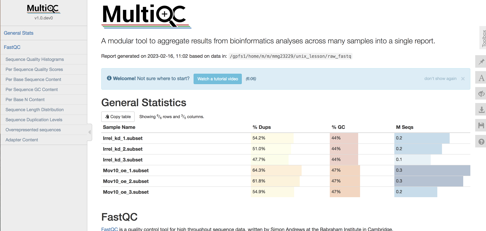

# Install Conda

Conda is an open sourced package management system. 

The first thing we need to do is download miniconda:

```bash
wget https://repo.anaconda.com/miniconda/Miniconda3-latest-Linux-x86_64.sh
```

And then run the bash command to install it:

```bash
bash Miniconda3-latest-Linux-x86_64.sh
```

A few interactive things will happen during this portion:

+ You will be asked to review the license agreement, hit return/enter to view it and the space bar to advance. At the end you will need to type + enter yes to accept.

+ It will ask if the installation location is ok. Since we are in our home directory, hit enter to accept. If you are not in your home directory, hit ctrl+c, navigate there, and start over with the bash command.

+ Finally, it will ask if you want to initialize Miniconda3. Say yes to this as well.

Now that it’s installed we need to reload the current shell session with:

```
source ~/.bashrc
```

## Managing environments
Conda allows you to create separate environments containing files, packages, and their dependencies that will not interact with other environments. When you begin using conda, you already have a default environment name `base`. The base environment is your "home base", and packages installed here will always be accessible to you regardless of your location within the server. However, you do not want to install all programs into your `base` environment as this can lead to some software conflicts. Instead, create a separate environment and install a package here. 


We will now create an environment called `multiqc` and install the `multiqc` package. 

Type the following:

```
conda create --name multiqc
```

Conda checks to see what additional packages ("dependencies") if it does ask type 'y'

```
Proceed ([y]/n)? y 
```

To use or activate the environment, type the following: 

```
source activate multiqc
```

Then you see your (base) switch to (multiqc). Now install multiqc program: 

```
conda install -c bioconda multiqc
```

Conda will check to see what additional packages ("dependencies") are required, type 'y'. 

```
Proceed ([y]/n)? y
```

This may take a few minutes. Once it is done you will see the following:

```
Preparing transaction: done                                                     
Verifying transaction: done                                                     
Executing transaction: done
```

To check that `multiqc` is working type: 

```
multiqc --help
```

If so, navigate to raw_fastq directory and type the following to generate a multiqc .html file. 

```
multiqc .
```

Multiqc will provide an aggregate result from bioinformatic analyses across many samples in a single report! 

The final output is an .html report that should look like this: 


<p align="center">

</p>

