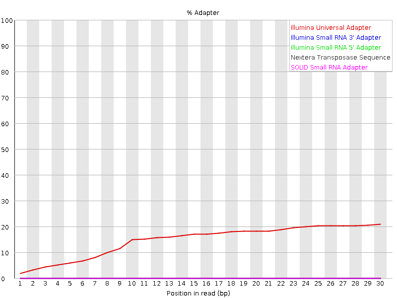

# Trimming with Trim Galore 

This tutorial gives a very brief introduction to read trimming. Read trimming
may be desirable to remove adapter sequence or poor quality sequence from reads
prior to analysis.

There are a number of tools that can be used for read trimming e.g.:

* [Cutadapt](https://cutadapt.readthedocs.io/en/stable/)
* [Trimmomatic](http://www.usadellab.org/cms/?page=trimmomatic)
* [fastp](https://github.com/OpenGene/fastp)
* [Trim Galore](https://github.com/FelixKrueger/TrimGalore/tree/master) 

They have a varying range of clipping and trimming features, but for simple
removal of adapter sequences they all perform the same, but the usage is different
for each.

In this example we will be using Trim Galore, a wrapper around Cutadapt and FastQC to consistenly apply adapter and quality trimming to FastQ files. 

## Fastq with adapter contamination

Here is a toy data set which features adapter contamination called `Test_adapter_contamination.fq.gz`.
This data can be found in this location: 

```bash
/gpfs1/cl/mmg3320/course_materials/trimmomatic_example
```

**Step 1: Run fastqc on `Test_adapter_contamination.fq.gz`**

**Step 2: Open the FASTQC file, either in RStudio or transfer via FileZilla, and interpret the results.** 

> Big take away: You should see that a number of the
plots show problems with the data. In particular the "Per sequence GC content"
plot and the "Adapter Content" plot:

<p align="center">

</p>

This shows that there is significant contaiminaion with "Illumina Universal Adapter". 

## Trimming with the Trim Galore

**USAGE:** `trim_galore [options] <filename(s)>`

### Some general options: 

**More options** can be found [here](https://github.com/FelixKrueger/TrimGalore/blob/master/Docs/Trim_Galore_User_Guide.md)

* `-h/--help`
  * Print this help message and exits.
 
* `-q/--quality <INT>`
  * Trim low-quality ends from reads in addition to adapter removal. For RRBS samples, quality trimming will be performed first, and adapter trimming is carried in a second round. Other files are quality and adapter trimmed in a single pass. The algorithm is the same as the one used by BWA (Subtract INT from all qualities; compute partial sums from all indices to the end of the sequence; cut sequence at the index at which the sum is minimal).
  * Default Phred score: `20`
  
* `--phred33`
  * Instructs Cutadapt to use `ASCII+33` quality scores as Phred scores (Sanger/Illumina 1.9+ encoding) for quality trimming.
  * Default: `ON`
  
* `--fastqc`
  * Run FastQC in the default mode on the FastQ file once trimming is complete.
  
* `--fastqc_args "<ARGS>"`
  * Passes extra arguments to FastQC. If more than one argument is to be passed to FastQC they must be in the form `arg1 arg2 [..]`.
  * An example would be: `--fastqc_args "--nogroup --outdir /home/"`.
  * Passing extra arguments will automatically invoke FastQC, so `--fastqc` does not have to be specified separately.

* `--illumina`
  * Adapter sequence to be trimmed is the first 13bp of the Illumina universal adapter `AGATCGGAAGAGC` instead of the default auto-detection of adapter sequence.

* `--gzip`
  * Compress the output file with `gzip`.
  * If the input files are gzip-compressed the output files will be automatically gzip compressed as well.

* `--dont_gzip`
  * Output files won't be compressed with gzip. This overrides `--gzip`.

* `-o/--output_dir <DIR>`
  * If specified all output will be written to this directory instead of the current directory. If the directory doesn't exist it will be created for you.

**Step 3: Now that you have read over the usage, run Trim Galore on `Test_adapter_contamination.fq.gz`.**
1. You will need to load the `trimgalore` module 
2. You will also need to load the `cutadapt` and the `fastqc` module
3. Use the `--illumina` option in your command 
4. Be sure to run FASTQC on the trimmed fastq file as well 

After you are done, inspect the FASTQC output. 
You should now see that the Illumina Universal Adapter have been successfully removed:

<p align="center">

</p>

If you look at the "Overrepresented sequences" table. You may observe that there
are other contaminants that remain. You may with to modify the adapter fasta 
file to include these so that they are also removed.

------------------------------------------------------------------------------

