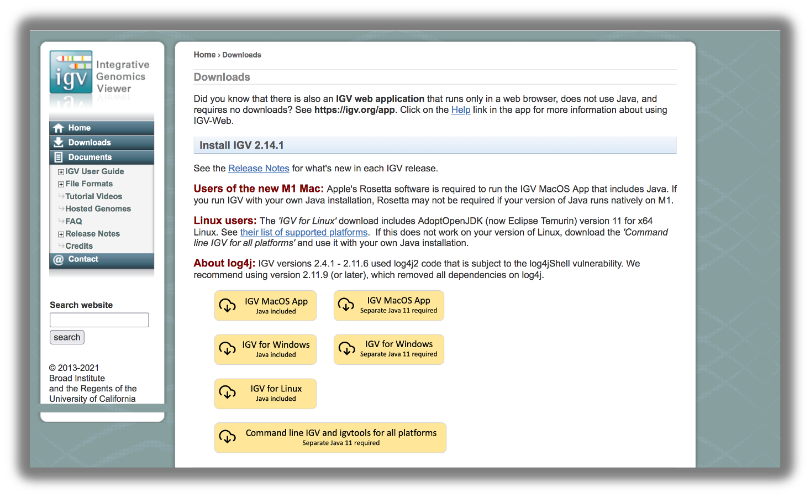

## Instructions on installing FileZilla: An FTP Client Software
FileZilla is a widely used FTP client that is free and open source. This will allow you to securely transfer files from your local desktop onto a server (for us its the VACC). 

Please download FileZilla Client using this [link](https://filezilla-project.org/)  
This is a really nice step-by-step [6-min youtube video](https://youtu.be/adxmlHDim6c) that will show you how to download FileZilla Client onto your laptop. 

### Filezilla - Step 1

Open up *FileZilla*, and click on the File tab. Choose 'Site Manager'.

### Filezilla - Step 2

Within the 'Site Manager' window, do the following: 

1. Click on 'New Site', and name it VACC
2. Host: vacc-user1.uvm.edu
3. Protocol: SFTP - SSH File Transfer Protocol
4. Logon Type: Normal
5. User: Username (i.e netid) 
6. Password: vacc password
7. Click 'Connect'

### Filezilla Interface

 Next, if this if your first time using Filezilla we recommend that you take some time to get familiar withe the basics of the interface. This [tutorial](https://wiki.filezilla-project.org/FileZilla_Client_Tutorial_(en)) is a helpful resource.

You will see two panels in the interface. On the left hand side you will see your the files in your laptop and on the right hand side you have your home directory on VACC. Now, you can freely move documents from the VACC to your laptop, by double clicking or dragging it over to the right side panel. You will need this to submit the .html document for homework assignments. 

## Download IGV 

This is a pretty simple download: https://software.broadinstitute.org/software/igv/download

  

