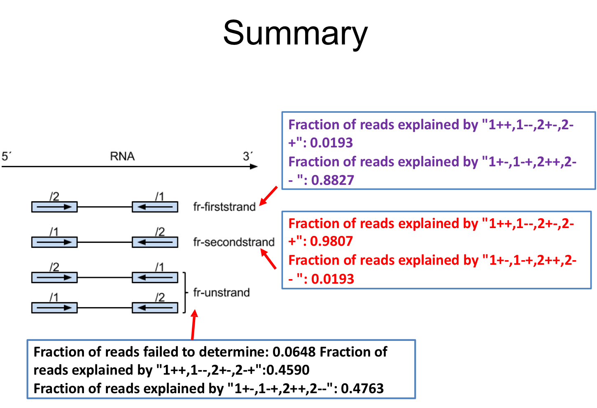

# Introduction to RSeQC

## Recap from last week 
We performed alignment on fastq files using STAR last week. Let's examine the outputs: 

```
Irrel_kd_1_Aligned.sortedByCoord.out.bam  Mov10_oe_1_Log.out
Irrel_kd_1_Log.out                        Mov10_oe_1_Log.progress.out
Irrel_kd_1_Log.progress.out               Mov10_oe_1__STARtmp
Irrel_kd_1__STARtmp                       Mov10_oe_1.subset.fq
Irrel_kd_1.subset.fq                      star_align2_8032184.out
Mov10_oe_1_Aligned.sortedByCoord.out.bam  star_align.sh
```

STAR produces multiple output files: 
* `sortedByCoord.out.bam`: sorted bam file, similar to samtools sort command 
* `Log.out`: main log file with a lot of detailed information about the run. This file is most useful for troubleshooting and debugging. 
* `Log.progress.out`: reports job progress statistics, such as the number of processed reads, % of mapped reads, etc. 
* `STARtmp`: temp directory 

**When the time comes, Multiqc will use the .out files to provide you with an aggregated report!**

## RSeQC
Now that you have aligned reads in the form of a .bam file, you can proceed to perform additional QC on the BAM files. The major reason we are using this package in class is to utiltize the `infer_experiment.py` module. However, the RSeQC package offers a number of modules including evaluating sequencing saturation, mapped reads distribution, coverage uniformity, strand specificity, etc. You can read more about the package at the [RSeQC website](https://pythonhosted.org/RSeQC/).

Using `infer_experiment.py` will allow us with a way, if need be, to determine "strandedness of reads". Since everyone is reanalyzing published datasets, the authors may have provided this information to you already in the Methods section (or the GEO summary). But this doesn't always happen and its important to know this prior to counting readings with the `HTseq-count` program. 

### To install RSeQC: 

```
conda create -n rseqc
```
Then type: 
```
source activate rseqc
```
Now you will see that you have moved from (base) to (rseqc). Now run: 
```
conda install -c bioconda bedops
```
This will take a minute or two, press 'y' when prompted. Then you will know the install is completed when you see 'done'. 

```
Proceed ([y]/n)? y 

Preparing transaction: done                                                     
Verifying transaction: done                                                     
Executing transaction: done
```

Now, you can install RSeQC - this will take 5 -10 minutes. 
```
pip install --user RSeQC
``` 

**Stop here before proceeding to next steps**

### Using RSeQC

Files needed to use `infer_experiment.py` RSeQC: 
* Aligned bam files 
* Index file for each bam file 
* A transcript bed file (in bed12 format)

```
BED12: A BED file where chrom, start, end, name, score, thickStart, thickEnd, itemRgb, blockCount, blockSizes, and blockStarts are listed in twelve columns.

For example: chr1 11873 14409 uc001aaa.3 0 + 11873 11873 0 3 354,109,1189, 0,739,1347,
```
more information about bed12 format can be found [here](https://bedtools.readthedocs.io/en/latest/content/general-usage.html)

Download datset we will be using for today's lesson:

```
/gpfs1/cl/mmg232/course_materials/htseq_example
```

Run the following line of code: 

```
infer_experiment.py -r humanv41GFF.bed12 -i unknown_sorted.bam
```

The output should look like this: 

```
Fraction of reads explained by "1++,1--,2+-,2-+": 0.0169
Fraction of reads explained by "1+-,1-+,2++,2--  ": 0.9030
```

Consider the following: 
What type of library kit was used to create this library? 
If you are using HISAT2 which parameter would you consider adding? How about for HTSeq? 

Below are images of the slides that will help you make these decisions. 

<p align="center">

</p>

<p align="center">

</p>

**Remember, once you log off today, you will need to use the command `conda activate rseqc` to use this program in the future!**


## Running HTSeq

First, you can always get more information on HTSeq by going to the external [link](https://htseq.readthedocs.io/en/release_0.11.1/count.html). In fact, any time you are running a new program on your own, make it a habbit to find and keep the manual or website open on your screen. 

Load the HTSeq module with `module load`: 

```
module load py-htseq-0.11.2-gcc-7.3.0-lbzmhgz
```

Run with help parameter to check that HTSeq is functional (again good practice!)
```
htseq-count --help
```

You should the following: 
```
usage: htseq-count [options] alignment_file gff_file

This script takes one or more alignment files in SAM/BAM format and a feature
file in GFF format and calculates for each feature the number of reads mapping
to it. See http://htseq.readthedocs.io/en/master/count.html for details.
```

**These are all the parameters you should be using. Take some time to read this.** 

```
-f {sam,bam}, --format {sam,bam}
type of <alignment_file> data, either 'sam' or 'bam'
(default: sam)

-s {yes,no,reverse}, --stranded {yes,no,reverse}
whether the data is from a strand-specific assay.
Specify 'yes', 'no', or 'reverse' (default: yes).
'reverse' means 'yes' with reversed strand interpretation

-i IDATTR, --idattr IDATTR
GFF attribute to be used as feature ID (default, suitable for Ensembl GTF files: gene_id)

-m {union,intersection-strict,intersection-nonempty}, --mode {union,intersection-strict,intersection-nonempty}
mode to handle reads overlapping more than one feature
(choices: union, intersection-strict, intersection-nonempty; default: union)

```
### Class Exercise 

In class, we have been practicing writing scripts to run multiple files at once using a `for loop`. Today, please submit a job, that will contain a single line of code to process the `unknown_sorted.bam` file into a count file. 

> Note htseq-count will take ~20 minutes to run just for this one sample. In the future, it is a good idea to create a `for loop` when you are ready to run your own samples.  

Below is all the information you will need to run `htseq-count`: 
+ parent directory: htseq_example
+ GFF: /gpfs1/cl/mmg232/course_materials/genome_index/star_index_hg38/gencode.v43.chr_patch_hapl_scaff.annotation.gtf
+ alignment_file: unknown_sorted.bam
+ -i : gene_id 
+ -m : union 
+ you will then need to redirect the output to another file called `unknown_reverse.count`
+ please take a look at all the parameters listed above, they should all find their way into your code! 

Job Submission parameters:
```
#!/bin/bash
#SBATCH --partition=bluemoon
#SBATCH --nodes=1
#SBATCH --ntasks=2
#SBATCH --mem=5G
#SBATCH --time=5:00:00
#SBATCH --job-name=htseq-count
# %x=job-name %j=jobid
#SBATCH --output=%x_%j.out
```

Once you have a line a code, go ahead and submit it. 

Check that your job is running using: 

```
squeue -u net_id 

squeue -u pdrodrig
```

If your job is not listed, this means that you code you submitted for processing contains an error and must be further troubleshooted. 